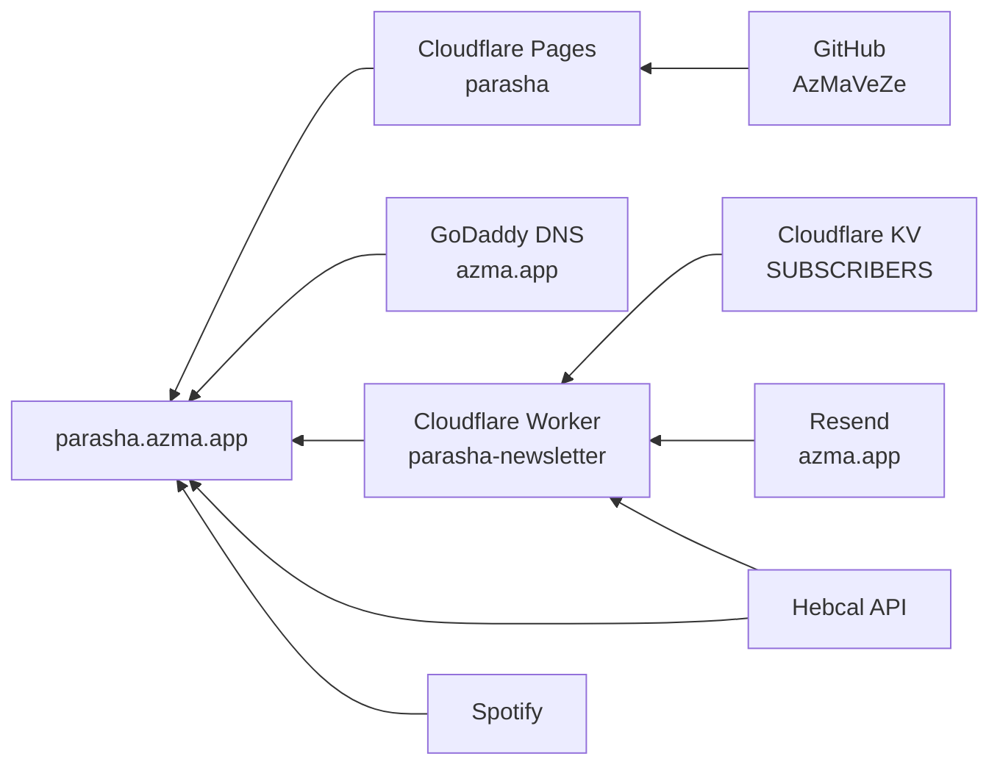

# שירותים וחשבונות

מי מחזיק מה, ודרך איזה חשבון. כשמשהו נשבר — זו הרשימה שאומרת לאן להיכנס.

<!-- הריפו הזה ציבורי. כתובות המייל המלאות אינן כאן אלא בעמוד ה-Notion הפרטי
     של הפרויקט. אין להוסיף כאן כתובות מייל, מפתחות או טוקנים. -->

## פעילים

| שירות | תפקיד בפרויקט | חשבון | מה נשבר בלעדיו |
|---|---|---|---|
| **GitHub** | הריפו `AzMaVeZe/parasha` (ציבורי), Actions לעדכון גופנים | משתמש **AzMaVeZe** | אין מקור לקוד; Cloudflare לא יוכל לבנות |
| **Cloudflare Pages** | מארח את האתר. פרויקט `parasha` | חשבון **Vezeazma** | האתר יורד |
| **Cloudflare Workers** | `parasha-newsletter` — דיוור ותגובות | אותו חשבון | אין הרשמה, אין תגובות, אין דיוור |
| **Cloudflare KV** | `SUBSCRIBERS` — נרשמים ותגובות | אותו חשבון | הנרשמים והתגובות נמחקים |
| **GoDaddy** | DNS של `azma.app` | חשבון **AzMa** | הדומיין מפסיק לפתור |
| **Resend** | שליחת המיילים מ-`parasha@azma.app` | לאימות | אין מייל אישור ואין דיוור |
| **Spotify** | הפודקאסט — [התוכנית](https://open.spotify.com/show/033Slu47b23754GaMTuroo) | לאימות | הנגנים באתר מפסיקים לעבוד |
| **Google Search Console** | אימות בעלות (`google94a43c73c2506559.html` בשורש) | לאימות | אין נתוני חיפוש; האתר עצמו לא נפגע |
| **Hebcal** | API ציבורי — איזו פרשה או חג קרובים | **ללא חשבון** | ההירו והדיוור לא יידעו מה השבוע |
| **Notion** | תיעוד הפרויקט | מחבר דרך חשבון claude.ai | התיעוד; הפרויקט לא נפגע |

## היסטוריים — לא בשימוש, אבל עדיין מקושרים

| שירות | מה נשאר ממנו |
|---|---|
| **Blogspot** | האתר הישן, `ariel-parasha.blogspot.com`. עדיין מקושר בכותרת התחתונה |
| **Box** | קישורי `box.net` ב-`js/data.js`, מתקופת הבלוג. גיבוי לדפים בלי PDF מקומי |
| **Google Drive** | תיקיית ה-PDF המקורית. כל הקישורים אליה **הוסרו** מהאתר |
| **NotebookLM** | מחברת "פרשת השבוע - אריאל", ששימשה להפקת פרקי הפודקאסט |
| **Google Forms + Sheets** | מערכת התגובות הראשונה. **הוצאה משימוש** — התגובות עברו ל-Worker |
| **GitHub Pages** | האחסון המקורי. **בוטל** (Unpublish) אחרי המעבר ל-Cloudflare |

## סודות — איפה הם, ואיפה הם לא

אף סוד אינו שמור בריפו. שלושתם יושבים כ-secrets ב-Cloudflare, ונקבעים מהמחשב של אריאל:

```
cd worker
npx wrangler secret list          # מציג שמות בלבד, לא ערכים
npx wrangler secret put <NAME>
```

| סוד | למה משמש |
|---|---|
| `RESEND_API_KEY` | שליחת מיילים |
| `ADMIN_KEY` | `/admin`, `/status`, `/moderate`, `/send`, `/testmail` |
| `OWNER_EMAIL` | לאן נשלחות התראות על תגובות חדשות. סוד ולא `var`, כדי שהכתובת לא תישב בריפו הציבורי |

`worker/wrangler.toml` מכיל הגדרות גלויות בלבד — כתובת האתר, כתובת השולח ומזהה ה-KV. אין בו מפתחות.

## שרשרת התלות



שים לב ש-**Cloudflare ו-GoDaddy הם שני חשבונות נפרדים**. הדומיין אינו מנוהל אצל Cloudflare אלא רק מצביע אליו ב-CNAME. זו הסיבה ששינוי DNS דורש כניסה ל-GoDaddy ולא ל-Cloudflare.

## כלל DNS שאסור לשכוח

הרשומה `parasha` ב-`azma.app` היא **CNAME**. תקן ה-DNS אוסר על רשומות-בת מתחת ל-CNAME, ולכן **אסור ליצור שום רשומה שנגמרת ב-`.parasha`**. זה כבר הפיל את האתר פעם אחת — ראו [`incidents.md`](incidents.md). רשומות Resend יושבות על השורש: `send`, `resend._domainkey`, `_dmarc`.
